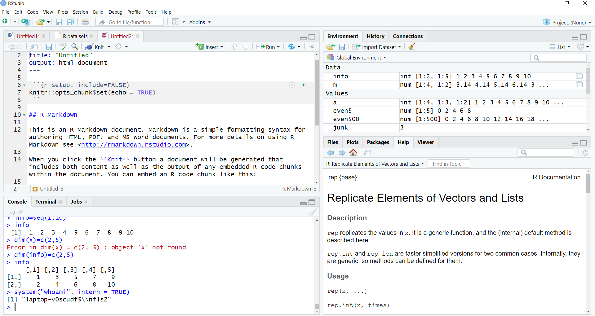

# probelm 1

```{r}
system("whoami", intern = TRUE)
```



# problem 2
```{r}
find.package("tidyverse")
find.package("readr")
find.package("foreign")
```

# Problem 3

## 3.1
### A.
```{r}
(79-32)*5/9
```

### B.

```{r}

(as.numeric(nhtemp)-32)*5/9

```

## 3.2

### A.
```{r}
temp1= c("wrath", "avarice", "sloth", "pride", "lust", "envy", "gluttony")
temp1
```

### B
```{r}
temp1[c(6,7)]
```

### C
Harvard, MIT, and Stanford are strings, thus cannot be performed arithmetic operation on, while bool values can be interpreted as 1 and 0, therefore can be performed arithmetic operation on

## 3.3

### A
#### first way

```{r}
numbers=c(49:20)
dim(numbers)=c(5,6)
t(numbers)
```

####second way

```{r}
numbers=seq(49,20)
matrix(numbers, nrow=6, byrow=TRUE)
```

#### third way
```{r}
numbers=c(49:20)
ma=matrix(numbers, ncol =6)
temp2= t(ma)
temp2
```

### B
```{r}
temp2[3,]
```

### C
```{r}
temp2[,c(2,4)]
```

## 3.4

### A
```{r}
data(women)
```

### B
```{r}
class(women)
mode(women)
```

### C
```{r}
str(women)
```

### D

#### i

```{r}
data(USArrests)
USArrests['California',]
```

#### ii
```{r}
USArrests[,"UrbanPop"]
```

#### iii

```{r}
subset(USArrests, Murder==min(Murder))
```

#### iv
```{r}
USArrests[USArrests$UrbanPop>=85,]
```

# 4
## A
pseudocode:

ftoc(int f){
if (f is not a number)
  raise error
else if (f is not in the range of Fahrenheit)
  raise error
else {
  transfer f to c
  return c;
  }
}


## B
```{r}
ftoc <- function(f){
  (f-32)*5/9
}
#ftoc(68)
```


