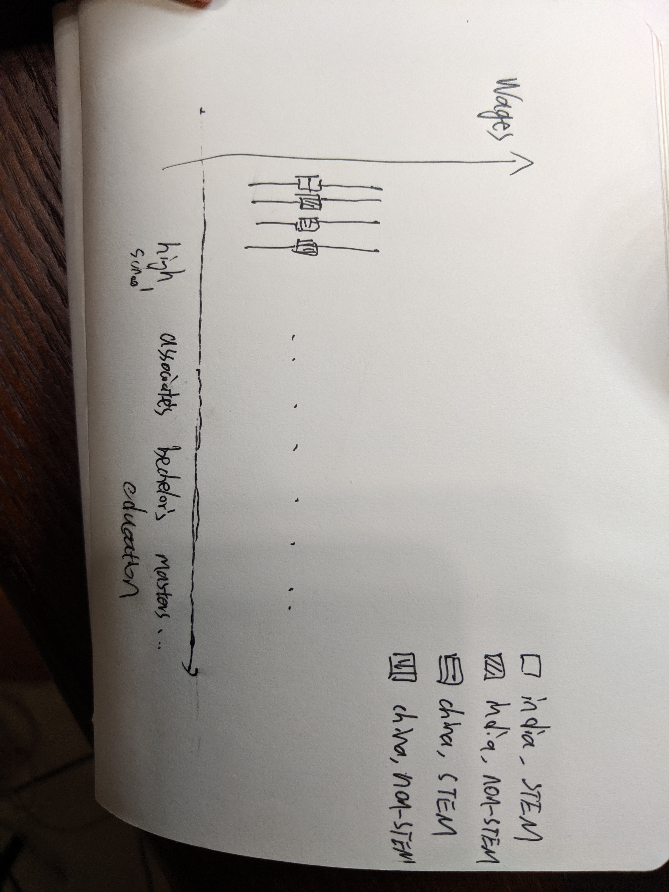

## R Markdown

Yining Wang
504983099
Stats 20 2019 Summer


# 1. Visialization

```{r}
library(readr)
library(dplyr)
library(stringr)
library(tidyr)
library(knitr)
PERM2018 <- read_csv("PERM2018.csv")
```


```{r}
#install.packages('ggplot2')
library(ggplot2)
```


```{r}
#PERM2018 %>% group_by(COUNTRY_OF_CITIZENSHIP) %>% summarise(count = n()) %>% arrange(desc(count))
```


```{r}
INDIADATA<-PERM2018%>%filter(COUNTRY_OF_CITIZENSHIP=="INDIA"& FOREIGN_WORKER_INFO_EDUCATION!="Other"&FOREIGN_WORKER_INFO_EDUCATION!="NA")
CHINADATA<-PERM2018%>%filter(COUNTRY_OF_CITIZENSHIP=="CHINA"& FOREIGN_WORKER_INFO_EDUCATION!="Other"&FOREIGN_WORKER_INFO_EDUCATION!="NA")

```


```{r}

#o <- ordered(PERM2018$FOREIGN_WORKER_INFO_EDUCATION, levels = c("None", "High School", "Associate's","Bachelor's","Master's","Doctorate"))
BOTHDATA <- rbind(CHINADATA, INDIADATA)
EDUCATION <- factor(BOTHDATA$FOREIGN_WORKER_INFO_EDUCATION,
    levels = c("None", "High School", "Associate's","Bachelor's","Master's","Doctorate","NA","Other"),ordered = TRUE)


ggplot(BOTHDATA,mapping=aes(x=EDUCATION,y=WAGE_OFFER_FROM_9089, color=COUNTRY_OF_CITIZENSHIP))+geom_boxplot(outlier.size = -1) + coord_cartesian(ylim=c(0,250000))+ labs(title="Relationship between education and wage for \n Chinese and Indian Permanent Employment \nCertification applicants", y="Wage")+theme_classic()+theme(axis.text=element_text(size=8))+ scale_fill_discrete(name = "Country of Citizenship")

```

# 2. The Brief Write-Up

PERM2018 is a dataframe of 117645 observations of 125 varaibles. It contains administrative data from employers’ Applications for Permanent Employment Certification (ETA Form 9089) and certification determinations processed by the Department’s Office
of Foreign Labor Certification, Employment and Training Administration, where the date of the determination was issued on or after October 1, 2017, and on or before September 30, 2018. 
  
In this report, I am trying to analyze the relationship between education level and wages for Indian and Chinese applicants, since applicants from India and China takes up more than half of all the applications. My first hypothesis is that the more education one got, the higher the wages would be, regardless of citizenship. My second hypothesis is that Indian applicants would have higher wages than their Chinese counterparts with the same level of education, since they are known to be more fluent in the language of English. 

I decided to use a boxplot to do the anlysis since it's easy to see the distribution of wages using a boxplot. I first reduce the data by picking only the observations with the COUNTRY_OF_CITIZENSHIP attribute being China, and then India. I also eliminated all the obervations which has education as "Others" or "NA" since they are not helpful to our analysis. At last I merge the China observations CHINADATA and India observations Indiadata into one single data frame called BOTHDATA. After that, I gave the education levle factor an order so that it would show from none, high school, all the way to doctorate in the boxplot nicely.

I erased all the outliers since they make the boxplot hard to read and they are not that meaningful. I gave x and y axis new names to make them more readable.I gave it a title that tells what the plot is about. I also changed the theme to make it look more simple in term of color thus easy to read. 

From the boxplot, we can see that my first hypothesis is wrong. Applicants with no education, especially those from India, has higer wages than those applicats with high shool education, and even associat's for Indians. Another weird thing is that for applicants from India, those with bechelor's degree make more money then those with master's degree and doctorate degree, and masters degree more than doctorate degree. Thus it's completly the opposite of my hypothesis for Indian applicants. For Chinese applicants the more education more wages hyoithesis generally apply.

My second hypothesis, that Indians would make more money than Chinese with same level of education is generally right, except when it comes to applicants with doctorate degrees. 
I did get some information from the boxplot I got. Thus, my choices for plotting were appropriate for the data


# 3. The Open-Ended Questions

## A.
I would add an attribute called "STEM related", which is a bool value showing if the applicant's job is STEM related. Since its bool value the values would be 0 and 1. We can get this value from looking at the job titles.

Another attribute I would like to add is religion, which would be a string value showing the name of the religious belief of the applicant. Example value would be "agnostic", "catholics", or "Christian". We can get the value by asking the applicants to provide it.

## B.
My questions would be :
1. Is there correlation between the nationality of the applicant and if the aplicants has a STEM related job ?

2. Is there a correlation between the applicant's religious belief and the applicant's wage?

3. Is there correlation between if the applicant's job is STEM related and the applicant's wage?

## C. 




